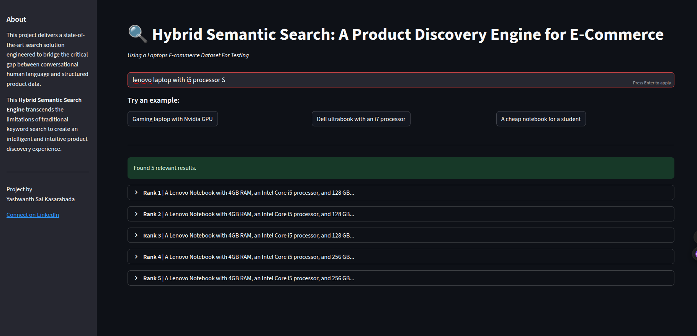

# Hybrid Semantic Search: A Product Discovery Engine for E-Commerce

A sophisticated, multi-layered search engine designed to understand natural language queries and provide highly relevant results for technical products like laptops.


---


## 📋 Table of Contents
1. [Project Overview](#-project-overview)
2. [How It Works](#-how-it-works)
3. [Key Features](#-key-features)
4. [Tech Stack](#-tech-stack)
5. [Setup and Installation](#-setup-and-installation)
6. [Usage](#-usage)
7. [Example Queries](#-example-queries)
8. [Project Structure](#-project-structure)
9. [Future Improvements](#-future-improvements)
10. [Dataset](#-dataset)
11. [License](#-license)
12. [Connect with Me](#-connect-with-me)

---

## 🚀 Project Overview

This project delivers a state-of-the-art search solution engineered to bridge the gap between conversational human language and structured product data. Traditional keyword-based systems often fail to capture user intent, leading to irrelevant results.  

This **Hybrid Semantic Search Engine** fuses **dense vector retrieval** (for semantic understanding) with **attribute-based filtering** (for technical accuracy). Using a sample dataset of laptop specifications, it demonstrates how search can evolve from a basic lookup tool into a powerful product discovery engine.

---

## 🔎 How It Works

1. **Query Processing**: Expands query with synonyms (WordNet) & extracts attributes (RAM, brand, CPU, etc.).
2. **Semantic Retrieval**: Encodes query → searches Pinecone vector DB for top-k similar items.
3. **Hard Filtering**: Removes candidates not matching explicit attributes (e.g., “16GB RAM”).
4. **Reranking**: Cross-encoder reorders remaining candidates for final precision.

---

## ✨ Key Features

- **Hybrid Search**: Semantic + keyword precision  
- **RESTful API**: FastAPI backend with interactive docs  
- **Web UI**: Streamlit frontend for user-friendly search  
- **Retrieve & Rerank Pipeline**: Fast + accurate results  
- **Query Expansion**: WordNet synonyms capture intent  

---

## ⚙️ Tech Stack

- **Backend**: Python  
- **API Framework**: FastAPI  
- **Web UI Framework**: Streamlit  
- **Vector Database**: Pinecone  
- **Embeddings & Reranking**: Sentence-Transformers (Hugging Face)  
- **NLP**: NLTK (WordNet)  
- **Data Handling**: Pandas  

---

## 🔧 Setup and Installation

1. **Clone the Repository**
   ```bash
   git clone <your-repository-url>
   cd semantic-search
   ```

2. **Create and Activate Virtual Environment**
   ```bash
   python -m venv .venv
   source .venv/bin/activate   # On Windows: .venv\Scripts\activate
   ```

3. **Install Dependencies**
   ```bash
   pip install -r requirements.txt
   ```
   *(Tip: keep a curated `requirements.txt` or use `pyproject.toml` for reproducibility.)*

4. **Configure Environment Variables**  
   Add your Pinecone credentials in `.env`:
   ```env
   PINECONE_API_KEY="YOUR_API_KEY_HERE"
   PINECONE_ENV="YOUR_ENVIRONMENT_HERE"
   ```

---

## 🚀 Usage

### Web Interface (Recommended)

1. **Start the FastAPI Backend**
   ```bash
   uvicorn app.api:app --reload
   ```
   Visit [http://127.0.0.1:8000/docs](http://127.0.0.1:8000/docs) for the interactive API docs.

2. **Launch the Streamlit Frontend**
   ```bash
   streamlit run app.streamlit_ui.py
   ```
   A browser tab will open with the UI.

---

### Legacy CLI Usage

1. **Build the Vector Index**
   ```bash
   python scripts/01_build_index.py
   ```

2. **Run the Interactive CLI**
   ```bash
   python scripts/02_search.py
   ```

---

## 🧑‍💻 Example Queries

Try out some searches:

- *"Lightweight gaming laptop with 16GB RAM under $1200"*  
- *"Dell laptop for programming with i7 processor and SSD"*  
- *"Business laptop with long battery life and touchscreen"*  

*(Consider adding screenshots of Streamlit UI and example responses here.)*

---

## 📂 Project Structure

```
semantic-search/
├── app/
│   ├── api.py                # FastAPI backend
│   └── streamlit_ui.py       # Streamlit frontend
├── scripts/
│   ├── 01_build_index.py     # Build vector index
│   └── 02_search.py          # Legacy CLI
├── src/
│   ├── pipeline/
│   │   └── semantic_pipeline.py
│   ├── processing/
│   │   ├── query_parser.py
│   │   └── wordnet_controlled.py
│   └── retrieval/
│       ├── embedder.py
│       ├── reranker.py
│       └── vector_index.py
├── artifacts/                # Index metadata
├── data/
│   └── laptop_data_cleaned.csv
├── .env
└── README.md
```

---

## 💡 Future Improvements

- **Enhance Web UI**: Search history, pagination, visualizations  
- **Filter Fallback**: Show semantic results if strict filtering fails  
- **Config Centralization**: Move keyword maps → `config.py`  
- **Model Fine-Tuning**: Train on domain-specific dataset  

---

## 📊 Dataset

The included dataset (`laptop_data_cleaned.csv`) is a cleaned sample of laptop specifications.  

---

## 📜 License

This project is licensed under the **MIT License** – free to use, modify, and distribute.  
See [LICENSE](LICENSE) for details.  

---

## 📬 Connect with Me

Let’s connect on LinkedIn to discuss this project or future collaborations!

[]([https://www.linkedin.com/in/your-linkedin-profile/](https://www.linkedin.com/in/yashwanth-kasarabada-ba4265258/))

